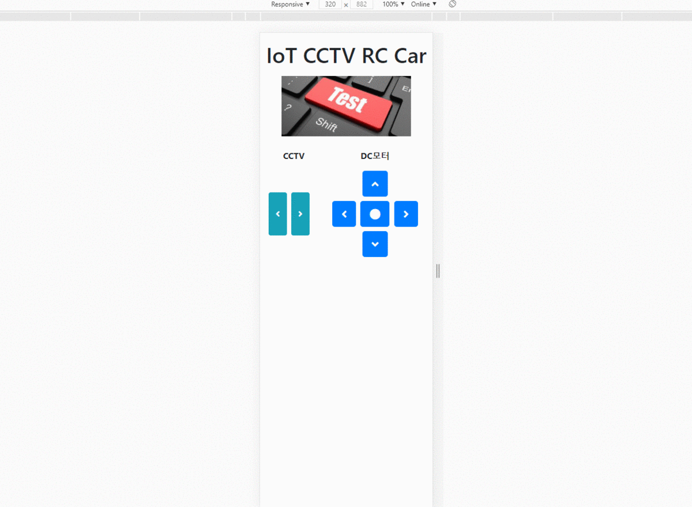
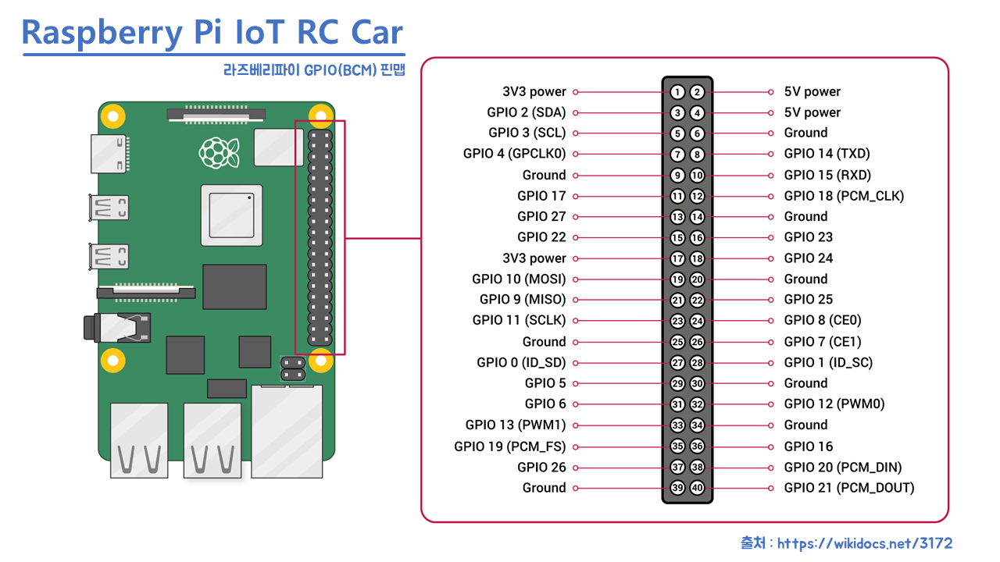
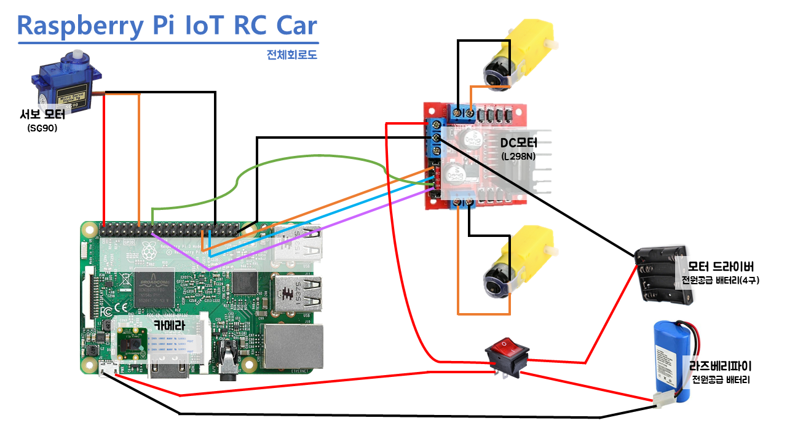

# IoT CCTV RC Car

라즈베리파이 IoT CCTV RC Car


## 1. 설치

```bash
# apt-get update & upgrade
sudo apt-get update
sudo apt-get upgrade

# install library
sudo apt-get install pigpio python-pigpio python3-pigpio
```


**pigpio** : 파이썬 연산작업에서 발생할 수 있는 사소한 오류를 해결해줍니다.

지터링이 생기는 경우 이를 써서 해결할 수 있습니다.


## 2. 실행방법

```bash
# Raspberry Terminal
cd BaseRaspberryPi/final/
sudo pigpiod
sudo python3 app.py
```


외부 접근을 하려면 공유기에서 `포트포워딩`을 해줘야합니다.

> Flask 기본 내부 Port : 5000


## 3. 실행화면




## 4. 회로도

### 1) 라즈베리파이 핀맵



### 2) 회로



> 단, DC모터의 핀 방향은 다를수 있습니다.


라즈베리파이가 전격전압이 5V, L298N의 경우에는 외부 전압을 줘야하기에

1개만 사용했을 때는 안정성이 낮아서 꺼지고 문제가 있으므로,

2개의 배터리를 이용하여 따로 외부전압을 주는 방식으로 수정